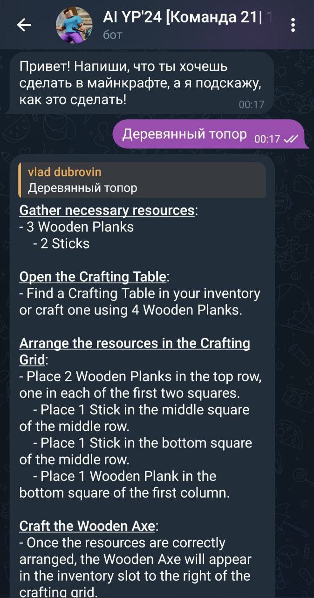

<html>
<body>
    <h1>Планер действий в Minecraft</h1>
    
Добро пожаловать в наш проект по созданию планера действий для Minecraft! Этот инструмент поможет игрокам организовать свои задачи и цели в игре, делая процесс игры более увлекательным и структурированным.

    <h2><strong>Куратор:</strong></h2>
    <ul>
        <li>Беляев Артём (tg: <a href="t.me/">@karaoke_tutu</a>, github: <a href="mailto:example@example.com">artbelyaev0</a>)</li>
    </ul>
    <h2>Команда 21:</h2>
    <ul>
        <li>Иванов Артемий Андреевич (tg: <a href="t.me/tony_the_cony">@tony_the_cony</a>, github: <a href="mailto:example@example.com">tony-the-cony</a>)</li>
        <li>Кульжик Степан Михайлович (tg: <a href="t.me/">@DopeStephen</a>, github: <a href="mailto:example@example.com">StephenKoulzhik</a>)</li>
        <li>Луговцев Тимур Андреевич (tg: <a href="t.me/">@skidroww</a>, github: <a href="mailto:example@example.com">skiroww</a>)</li>
        <li>Дубровин Владислав Леонидович (tg: <a href="t.me/">@vladospb</a>, github: <a href="mailto:example@example.com">vladospb</a>)</li>
        <li>Чечулин Николай Дмитриевич (tg: <a href="t.me/">@nchechulin</a>, github: <a href="mailto:example@example.com">NChechulin</a>)</li>
    </ul>
    <h2><strong>Описание проекта</strong></h2>
    
Текущие работы не умеют в сложные задачи по промпту (добыть железо, сделать броню и тд), потому что обучены только на 16 секундах. Поэтому предлагается взять уже обученного агента для игры в майнкрафт и добавить к нему планинг действий. Например, граф из действий или во few-shot через llm модели и посчитать success rate для задач.

    <h2><strong>Функции проекта</strong></h2>
    <ul>
        <li>ТГ-бот, возвращающий алгоритм действий для крафта предмета. Пример:</li>
         
        </img>
         
        <li>В разработке на данный момент: функция ТГ-бота для возвращения GIF с реализацией сложных действий действий в игре. В качестве примера подобная GIF, но с простейшим игровым действием, не требующим планирования:</li>
         
        
         
    </ul>
</body>
</html>